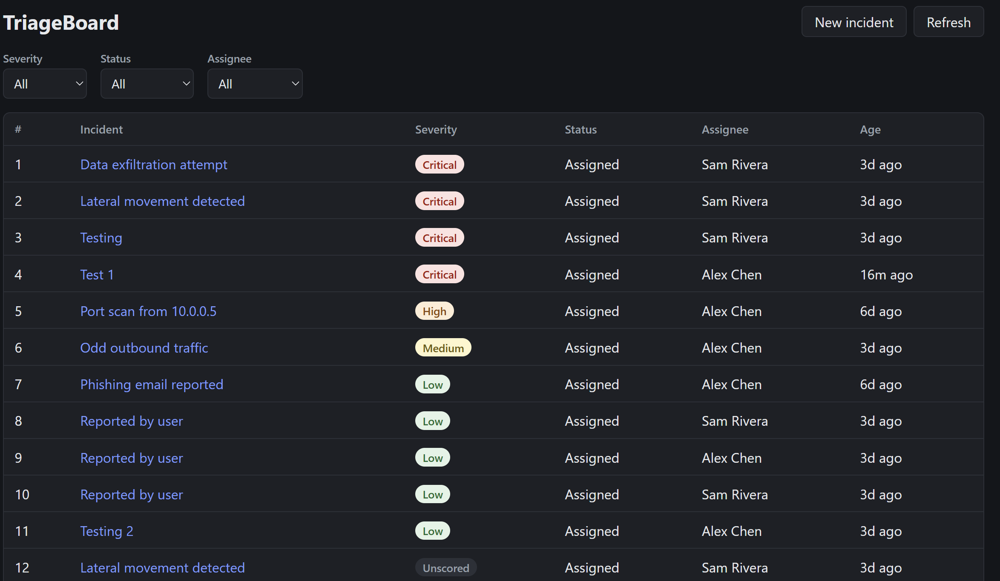
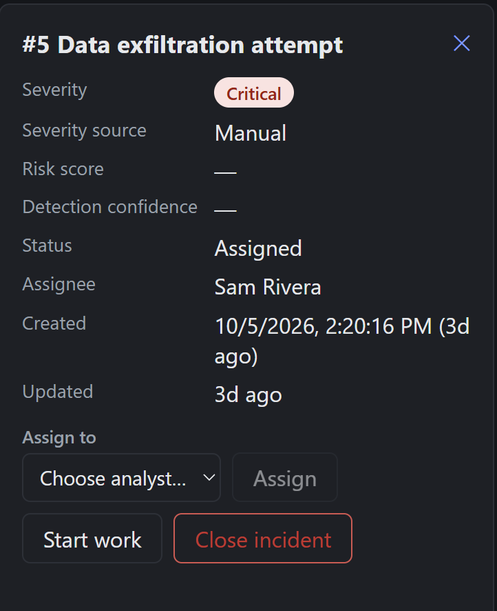
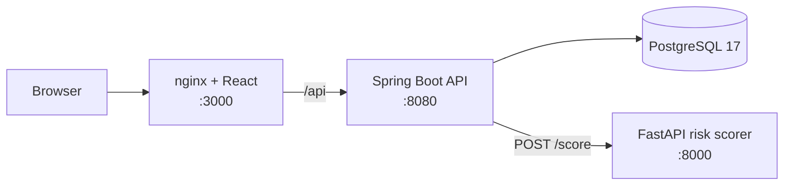

# TriageBoard


A full-stack incident tracker. Incidents are scored by a machine-learning risk model,
ordered in a priority triage queue, and auto-assigned to the least-loaded analyst.



## Features

- **Incident workflow:** create, assign, start, and close incidents through a REST API with enforced state rules
- **Priority triage queue:** severity first (Critical → Low, unscored last), then oldest first
- **Auto-assignment:** new incidents go to the active analyst with the fewest open incidents
- **ML severity scoring:** calls the [intrusion-risk-scoring-ai](https://github.com/aardranpk/intrusion-risk-scoring-ai)
  FastAPI service; a manual severity always takes priority, and incidents are still created if the scorer is down
- **React dashboard:** priority-ordered list, filters, detail panel with actions, inline validation errors



## Architecture



| Layer | Technology |
|---|---|
| Backend | Java 17, Spring Boot 4, Spring Data JPA, Flyway, Bean Validation |
| Database | PostgreSQL 17 |
| Frontend | React, Vite, served by nginx in Docker |
| Scoring | Python FastAPI service (separate repository) |
| Testing | JUnit 5, Mockito, MockMvc, MockRestServiceServer, Testcontainers, Vitest, React Testing Library |
| DevOps | Docker (multi-stage builds), Docker Compose, GitHub Actions |

## Quick start (Docker)

Requires Docker Desktop.

```bash
git clone https://github.com/aardranpk/triageboard.git
cd triageboard
docker compose up --build
```

Open http://localhost:3000. The scorer is built directly from its GitHub repository.

Add analysts so new incidents can be auto-assigned (PowerShell):

```powershell
Invoke-RestMethod -Method Post -Uri http://localhost:8080/api/analysts -ContentType "application/json" `
  -Body '{"name":"Alex Chen","email":"alex.chen@example.com"}'
Invoke-RestMethod -Method Post -Uri http://localhost:8080/api/analysts -ContentType "application/json" `
  -Body '{"name":"Sam Rivera","email":"sam.rivera@example.com"}'
```

Then click **New incident**, leave severity as *Unscored*, and enter a detection confidence (e.g. 0.93)
to see the model assign a severity.

Settings can be overridden in a `.env` file (see `.env.example`).

## Local development

| Service | Command | URL |
|---|---|---|
| PostgreSQL | `docker compose up -d postgres` | localhost:5432 |
| Scorer | in the scorer repo: `python -m uvicorn src.app.main:app --port 8000` | localhost:8000 |
| Backend | `cd backend` then `./mvnw spring-boot:run` | localhost:8080 |
| Frontend | `cd frontend` then `npm install` and `npm run dev` | localhost:5173 |

The Vite dev server proxies `/api` to the backend, so no CORS configuration is needed.

## API

| Method | Path | Description |
|---|---|---|
| POST | `/api/incidents` | Create (`title`, optional `description`, `severity`, `detectionConfidence`) |
| GET | `/api/incidents?status=` | List, optionally filtered by status |
| GET | `/api/incidents/{id}` | Get one |
| POST | `/api/incidents/{id}/assign` | Assign to an analyst (`analystId`) |
| POST | `/api/incidents/{id}/start` | ASSIGNED → IN_PROGRESS |
| POST | `/api/incidents/{id}/close` | Close |
| POST / GET | `/api/analysts` | Create / list analysts |
| GET | `/api/triage/queue` | Open incidents in priority order |
| GET | `/api/triage/next` | Highest-priority incident (204 if empty) |
| GET | `/api/triage/workload` | Open incident count per active analyst |

Errors use RFC 9457 problem details (`application/problem+json`), including per-field
validation messages.

## Data structures and complexity

TriageBoard keeps two in-memory structures alongside PostgreSQL. They are a deliberate
design choice for this project; a SQL `ORDER BY` could produce the same ordering on demand.

### Triage queue: `PriorityQueue<TriageEntry>` + `HashMap<Long, TriageEntry>`

Ordering: severity (CRITICAL → LOW, unscored last), then oldest first, then lowest id.

| Operation | Complexity | Notes |
|---|---|---|
| Add incident (`upsert`) | O(log n) | O(n) when replacing an existing entry |
| Highest priority (`peek`) | O(1) | |
| Remove incident (`remove`) | O(n) | `PriorityQueue.remove(Object)` is a linear search |
| Lookup by id (`contains`) | O(1) average | via the `HashMap` index |
| Full ordered list (`snapshot`) | O(n log n) | heap iteration order is not sorted, so a copy is sorted |

### Workload cache: `HashMap<Long, Integer>` (analyst id → open incidents)

| Operation | Complexity |
|---|---|
| Register / remove analyst | O(1) average |
| Increment / decrement load | O(1) average |
| Auto-assign (`leastLoadedAnalyst`) | O(a), a = active analysts |

A min-heap of analysts would make the auto-assign lookup O(1), but every load change would
then cost O(a) to re-position. With a small analyst pool, a linear scan is simpler.

### Consistency and limitations

- Both structures are rebuilt from the database at startup.
- Updates are applied only after the database transaction commits, so a rolled-back
  request never leaves the in-memory state out of sync.
- State lives in one application instance; running multiple API instances would need a
  shared store (e.g., Redis).
- Two incidents created at the same instant may both go to the same analyst; the result is
  a slight imbalance, never an error.
- All operations are `synchronized`: simple and correct, with one lock per structure.

## Severity scoring

When an incident is created with a `detectionConfidence` (0–1) and no manual severity,
the API calls the scorer (`POST /score`) and stores the returned severity and risk score.

- A manually supplied severity always wins; the scorer is not called.
- If the scorer is unreachable, slow (2 s timeout), or returns an unexpected response,
  the incident is still created, unscored, and a warning is logged.
- Trade-off: the scorer call happens inside the database transaction. At higher volume,
  scoring would move before the transaction or run asynchronously.

## Testing

| Suite | Tools | Count |
|---|---|---|
| Backend | JUnit 5, Mockito, `@WebMvcTest`, MockRestServiceServer, Testcontainers | 44 |
| Frontend | Vitest, React Testing Library, user-event | 22 |

Backend integration tests run against a throwaway PostgreSQL 17 container, so they never
touch development data. Docker must be running.

```bash
cd backend && ./mvnw test
cd frontend && npm test
```

GitHub Actions runs backend tests, frontend lint/tests/build, and Docker image builds on
every pull request. `main` is protected: changes arrive only through pull requests with
passing checks.

## Project structure

```
triageboard/
├── backend/            Spring Boot API (Maven)
│   └── src/main/java/com/aardranpk/triageboard/
│       ├── incident/   entity, repository, service, controller, DTOs
│       ├── analyst/
│       ├── triage/     PriorityQueue, workload cache, triage endpoints
│       ├── scoring/    FastAPI client
│       └── common/     errors, after-commit helper
├── frontend/           React (Vite) dashboard + nginx config
├── docker-compose.yml
└── .github/workflows/ci.yml
```